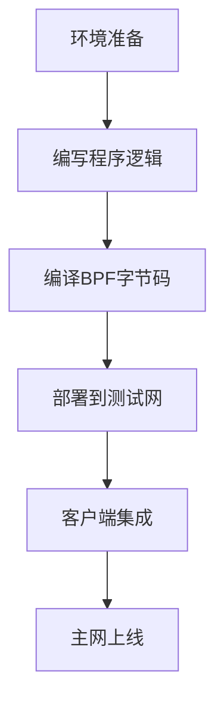

# Solana全方位解析：共识机制、钱包选择与生态发展全指南

## 一、Solana的核心创新：高性能区块链架构

作为新一代高性能公链，Solana以**每秒处理数千笔交易**和**亚秒级出块时间**的突破性表现，重新定义了区块链的性能边界。其核心技术突破源自独特的**历史证明（Proof of History, PoH）共识机制**，通过密码学时钟技术实现网络节点间的高效协同。

### 历史证明：区块链的加密时间戳系统
PoH通过高频可验证延迟函数（VDF）构建了事件顺序的密码学证明体系。这种创新机制相当于为区块链网络配备了**分布式原子钟**，节点无需等待其他节点确认即可验证事件的时间顺序。

> 📌 类比说明：想象拼图游戏中每块拼图都印有唯一编号，参与者可并行处理不同区域，最终拼图顺序自动验证完整性。

**技术优势对比表：**
| 传统共识机制 | Solana PoH机制 |
|------------|--------------|
| 依赖节点投票达成共识 | 通过密码学验证时间顺序 |
| 高延迟通信开销 | 降低90%共识通信成本 |
| TPS上限约100-1000 | 实测TPS超65,000 |

## 二、Solana智能合约架构解析

Solana采用独特的**程序与状态分离模型**，与以太坊EVM架构形成显著差异：

### 核心架构特性
1. **无状态程序设计**：智能合约仅包含逻辑代码，不存储状态数据
2. **账户驱动模型**：状态数据存储在外部账户中，实现程序逻辑与数据的解耦
3. **BPF字节码执行**：通过伯克利包过滤器（BPF）实现高性能合约执行

```rust
// 智能合约核心处理函数示例
fn process_instruction(
    program_id: &Pubkey, 
    accounts: &[AccountInfo], 
    instruction_data: &[u8]
) -> ProgramResult {
    // 合约逻辑处理
    Ok(())
}
```

### 开发工具链
- 支持Rust、C/C++开发
- 提供BPF编译器工具链
- CLI命令行工具与JSON RPC API

👉 [探索Solana生态项目](https://bit.ly/okx_welcome)

## 三、钱包生态系统全景图

Solana钱包体系支持多场景应用，满足不同用户需求：

### 钱包类型对比表
| 钱包类型     | 代表产品          | 安全特性                | 适用场景              |
|------------|-----------------|-----------------------|---------------------|
| 移动钱包     | Trust Wallet    | 移动端加密存储          | 日常高频交易          |
| 网页钱包     | Phantom         | 浏览器插件，私钥本地存储  | DApp交互            |
| 硬件钱包     | Ledger Nano S/X | 物理设备隔离私钥        | 大额资产存储          |
| 命令行钱包   | Solana CLI      | 脚本自动化支持          | 开发者高级操作        |

**网络选择指南**：
- Mainnet Beta：生产环境主网
- Devnet：开发者测试网络
- Testnet：协议验证测试网络

## 四、Solana生态全景与Dex发展

### 核心生态项目矩阵
| 领域       | 代表项目         | 创新特性                  |
|----------|---------------|-------------------------|
| 去中心化交易所 | Raydium       | 自动做市商+订单簿混合模式   |
| 稳定币协议   | Saber          | 跨资产兑换专用AMM         |
| NFT市场    | Metaplex       | 原生NFT发行标准支持       |
| Web3基础设施 | Neon EVM       | 以太坊兼容虚拟机          |

### Raydium DEX技术亮点
- **集中流动性模型**：允许流动性提供者自定义价格区间
- **跨链协议支持**：集成Serum跨链订单簿
- **质押收益聚合**：自动复利质押机制

```json
// Raydium Swap交易示例
{
  "tokenIn": "SOL",
  "tokenOut": "USDC",
  "amountIn": "0.1",
  "slippage": "0.5%"
}
```

👉 [体验Solana生态应用](https://bit.ly/okx_welcome)

## 五、智能合约开发实战指南

### 开发环境搭建流程
1. 安装Rust工具链
2. 配置Solana CLI工具
3. 启动本地测试节点
```bash
# 初始化测试网络
solana-test-validator
# 部署智能合约
solana program deploy target/deploy/helloworld.so
```

### 核心数据结构解析
| 结构体       | 功能描述                    |
|------------|---------------------------|
| Pubkey     | 32字节账户地址表示          |
| AccountInfo| 账户元数据与状态存储        |
| Instruction| 智能合约调用指令封装        |
| ProgramResult| 合约执行结果与错误处理    |

## 六、FAQ：高频问题解答

### Q1：Solana相比其他公链的核心优势是什么？
A：通过PoH共识机制和BPF执行引擎，实现**高吞吐量（65k TPS）**与**低交易费用（$0.00025/笔）**的完美平衡，同时保持去中心化特性。

### Q2：如何选择合适的Solana钱包？
A：根据使用场景选择：
- 开发者：Phantom（支持DApp调试）
- 普通用户：Coin98（多链支持）
- 机构用户：硬件钱包+命令行工具

### Q3：Solana智能合约开发需要注意哪些安全事项？
A：三大核心安全实践：
1. 严格验证账户权限
2. 限制指令执行复杂度
3. 使用Borsh进行安全序列化

### Q4：如何参与Solana生态建设？
A：多维度参与路径：
- 开发者：构建DApp或协议
- 流动性提供者：在Raydium提供流动性
- 节点运营商：运行验证节点

### Q5：Solana的未来技术路线图包含哪些关键升级？
A：2024年重点规划：
- 流动性证明（PoL）机制优化
- 零知识证明集成
- 跨链互操作性协议升级

## 七、扩展应用场景与生态展望

### 典型应用场景案例
1. **DeFi聚合器**：通过Solana的高TPS支持实时跨协议套利
2. **Web3社交平台**：利用低手续费特性实现微支付社交打赏系统
3. **实时游戏经济**：亚秒级确认支持多人在线游戏实时交易

### 生态发展数据（2024Q1）
| 指标              | 数值           |
|------------------|--------------|
| 活跃开发者数量     | 12,000+      |
| DApp数量          | 450+         |
| TVL（总锁定价值） | $2.1B        |
| 每日交易量        | 850万笔      |

👉 [参与Solana生态建设](https://bit.ly/okx_welcome)

## 八、技术进阶：从零构建智能合约

### 开发流程示意图


### 合约安全最佳实践
1. 使用`try_from_slice`进行数据反序列化
2. 严格验证账户所有权
3. 实现自定义错误码
4. 设置指令执行复杂度上限

通过系统性的技术架构创新和持续的生态建设，Solana正在构建下一代高性能区块链基础设施。无论是开发者、投资者还是普通用户，都能在这个快速演进的生态系统中找到自己的参与方式。随着持续的技术迭代和生态扩展，Solana正在重新定义区块链技术的性能边界和应用可能性。