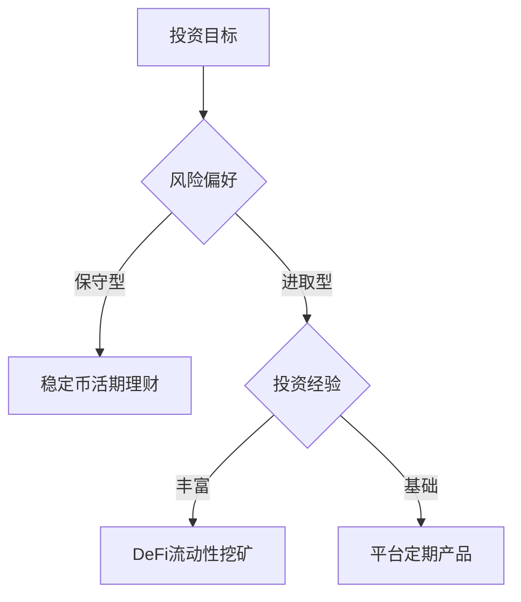

# 全面剖析加密理财产品市场的现状、风险与未来发展

## 市场规模与增长潜力

根据行业数据显示，全球加密货币理财市场在2021年已达到2920亿美元规模，同比增长超过600%。尽管当前市场处于调整期，但长期发展态势依然向好。随着区块链技术的成熟与应用场景的拓展，预计未来五年复合年增长率将保持在20%以上。

👉 [探索全球领先加密交易平台](https://bit.ly/okx_welcome)

### 核心参与群体特征
- 年龄集中在30-45岁的科技从业者
- 具备较高风险承受能力的高净值人群
- 追求资产多元化配置的机构投资者
- 热衷新兴技术的年轻投资群体

### 市场驱动因素
| 驱动要素          | 具体表现                          |
|-------------------|-----------------------------------|
| 技术创新          | 智能合约、跨链技术持续突破        |
| 监管框架完善      | 主要国家试点监管沙盒机制          |
| 机构入场          | 传统金融机构推出加密资产产品      |
| 全球支付需求      | 新兴市场跨境支付需求激增          |

## 产品类型解析

### 去中心化金融（DeFi）产品
DeFi生态通过智能合约实现自动化金融服务，主要形态包括：
1. **流动性池**（如Curve）
2. **借贷协议**（如Aave、Compound）
3. **收益聚合器**（如Yearn）

以Yearn为例，其Fantom链上的DAI Vaults年化收益率可达24.96%，通过算法自动优化资金配置实现收益最大化。

### 中心化金融（CeFi）产品
交易平台提供的理财产品具有以下特征：
- 活期理财：支持随时存取，年化收益约3-7%
- 定期理财：锁定期限获取更高收益（6-12个月）
- 定投计划：分散市场波动风险
- 双币投资：结合期权策略获取增强收益

👉 [获取专业理财服务](https://bit.ly/okx_welcome)

### 产品选择决策树

## 风险管理体系

### 四大核心风险维度
1. **市场波动风险**：比特币单日波动幅度常超5%，极端行情可达20%
2. **智能合约风险**：2022年DeFi攻击事件导致超20亿美元损失
3. **流动性风险**：部分代币买卖价差可达10%以上
4. **监管政策风险**：全球92%国家尚未建立完整监管框架

### 风险对冲策略
| 风险类型   | 缓释措施                          |
|------------|-----------------------------------|
| 市场波动   | 跨资产配置、动态调整持仓比例      |
| 智能合约   | 选择审计完善项目、分散投资        |
| 流动性     | 配置部分稳定币、设置赎回缓冲金    |
| 监管       | 关注政策动态、选择合规运营平台    |

## 监管环境演进

### 全球监管格局
- **开放型**：新加坡、瑞士等国建立沙盒机制
- **观望型**：欧盟MiCA法案即将实施
- **限制型**：部分国家禁止加密货币交易

2023年国际清算银行（BIS）报告显示，78%的央行正在研究或试点央行数字货币（CBDC），这将重塑加密资产监管框架。

### 合规发展路径
1. 实施严格的KYC/AML程序
2. 建立透明的资产托管机制
3. 对接传统金融监管系统
4. 开发合规稳定币产品

👉 [了解合规加密服务](https://bit.ly/okx_welcome)

## 未来发展趋势

### 技术创新方向
- 零知识证明提升交易隐私性
- 跨链协议实现资产互通
- 人工智能优化收益策略
- 机构级风控系统开发

### 市场演进预测
| 时间节点 | 市场特征                      |
|----------|-------------------------------|
| 2023-2024| 监管框架成型，机构资金入场      |
| 2025     | 合规稳定币成为主流投资标的      |
| 2026-2027| 链上保险产品全面覆盖市场风险    |
| 2028+    | 与传统金融体系深度融合          |

## 投资者FAQ

### 如何选择DeFi或CeFi产品？
建议新手从CeFi产品入手，逐步过渡到DeFi领域。CeFi提供更友好的操作界面和客服支持，而DeFi则能提供更高收益但需要较强的技术理解能力。

### 加密理财的税收如何处理？
各国政策存在差异，建议咨询专业税务顾问。基本原则是：持有超过1年可能享受资本利得优惠税率，频繁交易需按普通收入计税。

### 熊市环境下如何配置？
建议采取"核心+卫星"策略：70%配置优质底层资产（如BTC、ETH），30%用于波段操作。同时保持20%现金储备应对极端行情。

### 如何评估项目安全性？
重点考察：团队背景、审计报告、社区活跃度、资金池规模。建议优先选择TVL（总锁定价值）超过10亿美元的头部项目。

### 收益率波动原因？
主要受市场流动性、协议参数调整、链上活动量等因素影响。建议关注APR（年化收益率）与APY（复合年化收益率）的差异。

### 法规变化应对策略？
建立政策追踪机制，配置专业合规团队。重点关注反洗钱（AML）、投资者保护、税收政策三大领域。

## 发展建议

### 对投资者
1. 构建多元化投资组合
2. 设置动态止盈止损机制
3. 持续学习区块链技术知识
4. 选择通过ISO27001认证的平台

### 对行业参与者
1. 加强技术审计与安全防护
2. 开发教育内容降低使用门槛
3. 建立行业自律组织
4. 推动标准化产品设计

当前市场正处于重要转折点，专业机构的入场将加速行业规范化进程。随着技术迭代与监管框架完善，加密理财有望成为数字时代的重要资产配置方向。